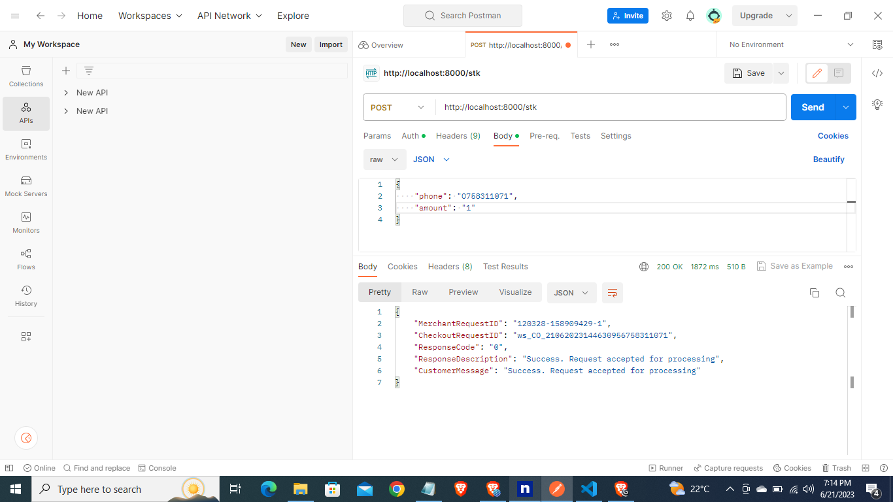
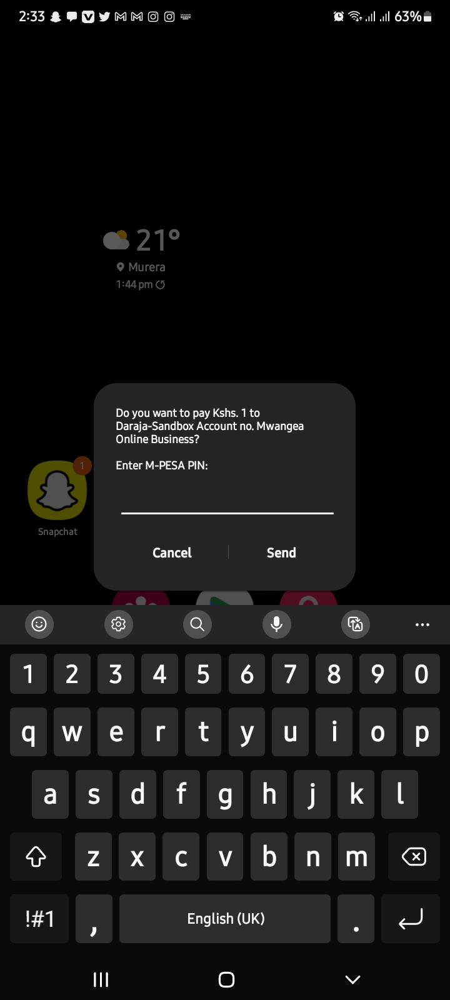
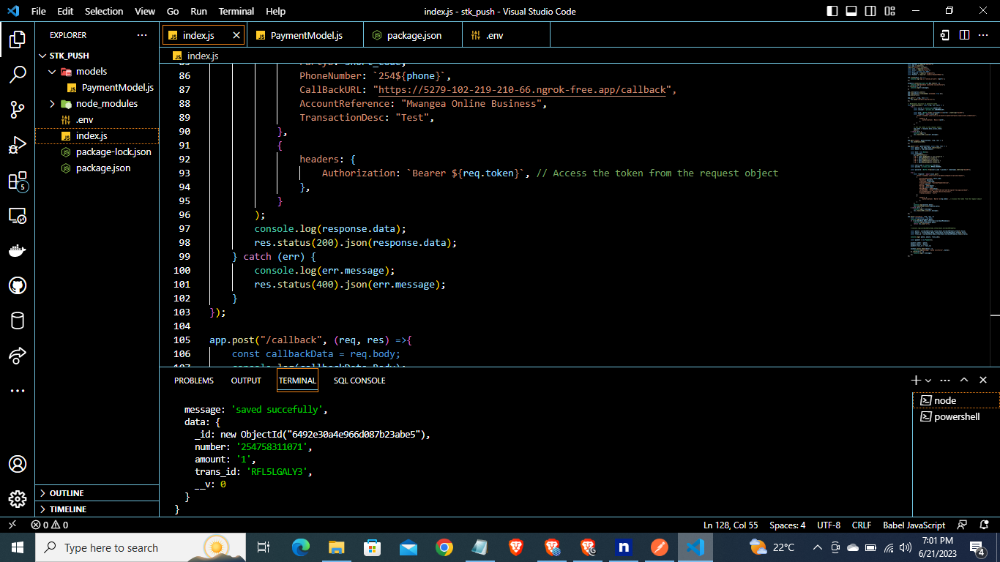

# stk_push
Lipa na Mpesa Stk push
# stk_push
Lipa na Mpesa Stk push
# Mpesa Express Daraja API integration in Nodejs and express
it's a method to send a payment notification to the user, prompting them to pay for a particular order using the stk push API. After the user completes the payment, the system cross-checks the payment status using a checkout request ID to ensure the transaction is successful.

## Built with

make sure you have installed: [node js](https://nodejs.org/en/download).

## Getting Started
To run this project.

## Installation
1.Clone the repo
```
git clone https://github.com/Mwangea/stk_push.git
```
2.Install NPM packages
```
npm install
```
3.Create a .env file and add the following values. Retrieve them from the Safaricom daraja portal [here](https://developer.safaricom.co.ke/)
```
PORT = 8000
PAY_BILL = 
MPESA_PASSKEY = 
SECRET_KEY = 
CONSUMER_KEY = 
DB =  
```
4.Run server
```
npm start dev
```
5.I have used [ngrok](https://ngrok.com/download) for my callbackurl
```
ngrok http 8000
```
6.Use postman to make requests.

7.STK pop up on your phone


8.Successfull Transaction


## Contributing

Pull requests are welcome. For major changes, please open an issue first
to discuss what you would like to change.Don't forget to give the project a star! Thanks again!

Please make sure to update tests as appropriate.

## Contact
Phone: <a href="tel:0758311071">0758311071</a>

